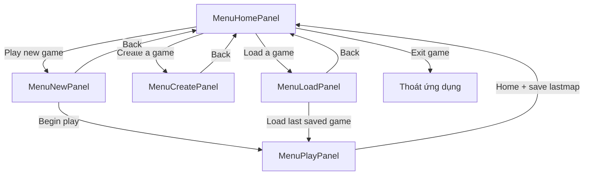
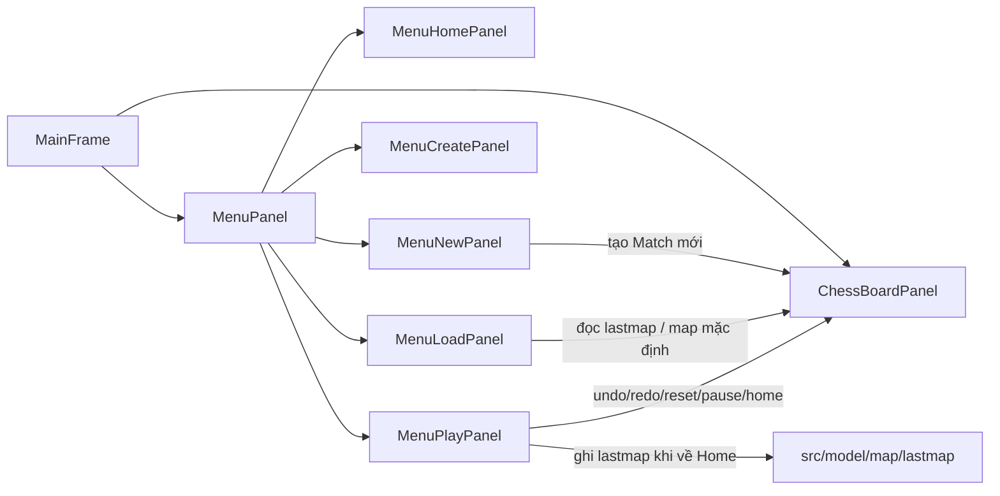

# Mock các màn hình menu và cách chúng tương tác

File này mô tả nhanh bố cục (mock/wireframe) của các màn hình menu hiện có trong `MenuPanel` và luồng chuyển giữa chúng.

## 1. Sơ đồ tương tác giữa các màn hình



## 2. Sơ đồ tương tác component



## 3. Mock từng màn hình

### 3.1 `MenuHomePanel`

```text
+--------------------+
| [ New Game ]       |
| [ Create Game ]    |
| [ Load Game ]      |
| [ Exit ]           |
+--------------------+
```

- Điểm vào chính của luồng menu.
- Nút **Load Game** chuyển sang `MenuLoadPanel`, không vào game trực tiếp.

### 3.2 `MenuNewPanel`

```text
+----------------------------------+
| [<- Back]              [OK ->]   |
|                                  |
| Select player mode:              |
| (o) Human vs. Computer           |
| ( ) Human vs. Human              |
|                                  |
| Who will play first?             |
| (o) Computer                     |
| ( ) Human                        |
|                                  |
| Select level:                    |
| (o) Captain America              |
| ( ) Iron Man                     |
| ( ) Thor                         |
| ( ) Hulk                         |
|                                  |
| [ character preview image ]      |
+----------------------------------+
```

- **Back** quay về `MenuHomePanel`.
- **OK** tạo `Match` mới, đồng bộ `ChessBoardPanel`, rồi chuyển sang `MenuPlayPanel`.
- Ghi chú: text level đầu tiên trong code hiện tại vẫn đang là `Captain Amerian`.

### 3.3 `MenuCreatePanel`

```text
+--------------------+
| Create Game        |
| [<- Back]          |
+--------------------+
```

- Hiện đang là màn hình placeholder.
- Chỉ có hành vi quay về `MenuHomePanel`.

### 3.4 `MenuLoadPanel`

Mock theo layout hiện tại:

```text
+----------------------------------+
|            LOAD GAME             |
|     Resume your latest saved     |
|             match                |
|                                  |
|      +--------------------+      |
|      |  opponent preview  |      |
|      +--------------------+      |
|                                  |
|        Saved match ready         |
|       Mode: Human vs Com         |
|          Turn: Human             |
|            Level: 2              |
|     Data source: lastmap         |
|                                  |
|              [ OK ]              |
|             [ Back ]             |
+----------------------------------+
```

- Khi người dùng mở màn hình này từ `MenuHomePanel`, panel sẽ:
  - đọc lại `lastmap` nếu có
  - nếu không có thì dùng map mặc định
  - cập nhật phần preview + metadata trước khi hiển thị
- **OK** sẽ nạp `Match` vào `ChessBoardPanel` rồi chuyển sang `MenuPlayPanel`.
- **Back** quay về `MenuHomePanel`.

Ảnh mock/layout đã chụp:


### 3.5 `MenuPlayPanel`

```text
+----------------------------------+
| [com avatar]       [thinking]    |
|                                  |
|                                  |
|                                  |
| [home] [reset] [hint]            |
| [undo] [pause/play] [redo]       |
|                                  |
| Level [==== slider ====]         |
|                                  |
| [human avatar]                   |
+----------------------------------+
```

- Đây là panel điều khiển bên phải của màn chơi.
- Tương tác trực tiếp với `ChessBoardPanel` qua:
  - undo / redo
  - pause / play
  - reset
  - thay đổi level
  - về home và lưu `lastmap`

## 4. Luồng sử dụng chính

### Chơi ván mới

```text
Home -> New Game -> chọn mode/level -> OK -> Play
```

### Tải ván gần nhất

```text
Home -> Load Game -> xem preview save -> OK -> Play
```

### Quay về menu chính từ lúc đang chơi

```text
Play -> Home button -> ghi lastmap -> Home
```
